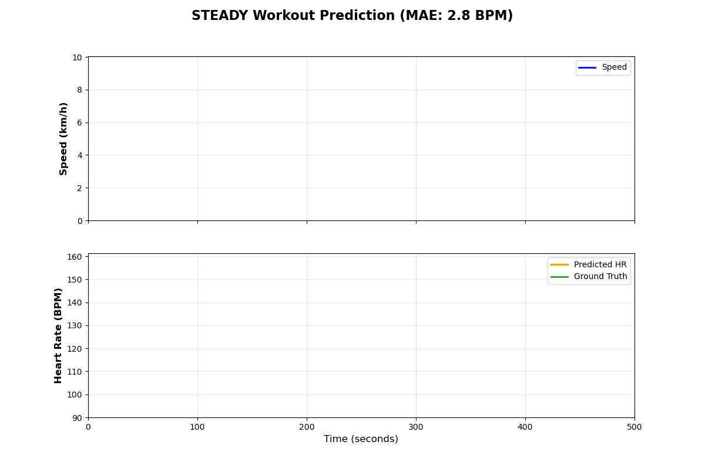
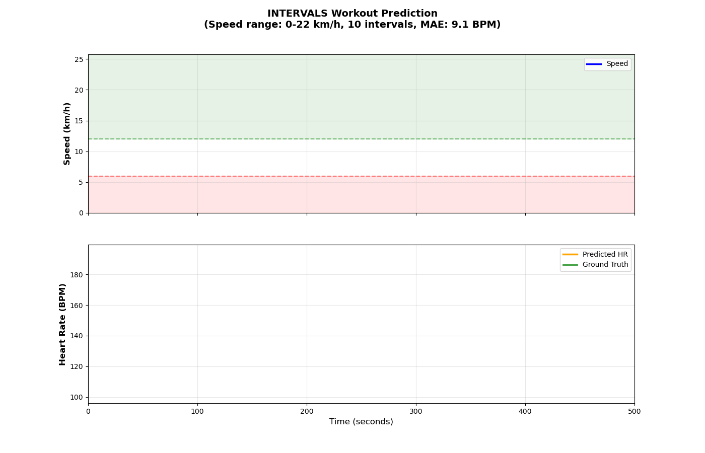
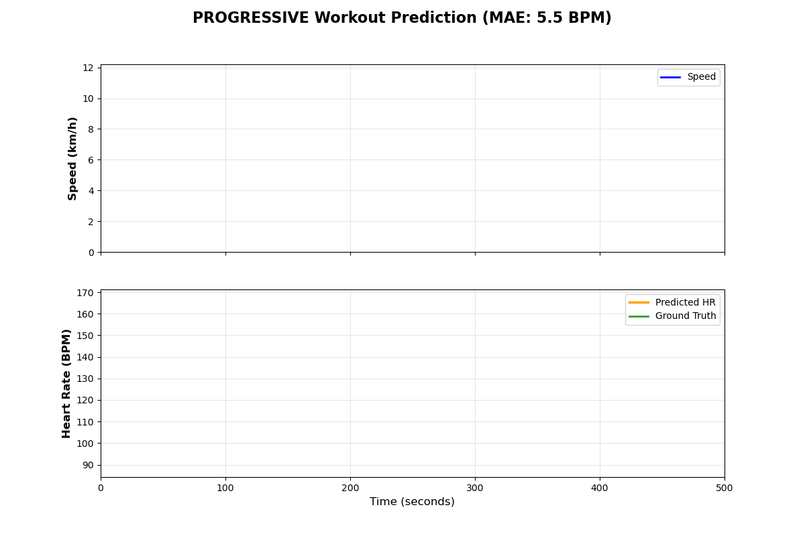

# Heart Rate Prediction from Running Data (SUB3_V2)

## Interactive Demo

**Try the model now**: [Heart Rate Predictor Space](https://huggingface.co/spaces/rricc22/heart-rate-predictor)

Upload your running data (speed & altitude) and get instant heart rate predictions in your browser. No installation required!

## Model Description

This LSTM-based model predicts heart rate (BPM) from running workout data (speed and altitude). It's designed for runners training for sub-3-hour marathons to optimize their training by predicting physiological responses.

**Model Architecture**: 2-layer LSTM with 128 hidden units  
**Parameters**: ~206K trainable parameters  
**Input Features**: 14 engineered features (speed, altitude, gender + temporal features)  
**Output**: Time-series heart rate predictions in BPM

## Intended Use

### Primary Use Cases
- Predict heart rate response during running workouts
- Analyze training intensity without heart rate monitor
- Plan workout zones based on speed/elevation profiles
- Research on physiological modeling for endurance sports

### Out-of-Scope
- Medical diagnosis or treatment decisions
- Non-running activities (cycling, swimming, etc.)
- Real-time monitoring (model requires complete workout data)

## Model Performance

| Metric | Test Set Performance |
|--------|---------------------|
| MAE    | **7.42 BPM** ✨      |
| RMSE   | **9.54 BPM**        |

**Baseline Comparison** (V1 models):
- V1 LSTM Baseline: 13.88 BPM MAE
- V1 Best (Finetuned): 8.94 BPM MAE
- **V2 Model (this model)**: **7.42 BPM MAE** (17% better than best V1!)

### Example Predictions on Test Set

The model accurately predicts heart rate across different workout types:

**Steady Pace Run** - Consistent speed, stable HR response:



**Interval Training** - Variable intensity with HR peaks:



**Progressive Run** - Gradually increasing pace and HR:



*These are real predictions from the held-out test set (unseen during training).*

## Training Strategy

### Dataset Preparation

**Source**: Endomondo HR dataset (public running workouts)  
**Initial Size**: 974 running workouts after quality filtering  
**Final V2 Dataset**: Enhanced with improved preprocessing

**Key Improvements over V1**:
1. **Better Quality Filtering**: Removed workouts with GPS errors, unrealistic HR values, or excessive missing data
2. **Speed Computation**: Calculated speed from GPS coordinates when missing, using haversine distance
3. **Smoothing**: Applied moving average to reduce sensor noise while preserving workout patterns

### Feature Engineering (V2)

We engineered **14 features** from the basic speed and altitude signals to capture physiological response patterns:

**Base Features (3)**:
- `speed`: Running speed (km/h) from GPS
- `altitude`: Elevation (m) from GPS/barometer  
- `gender`: Binary encoding (1=male, 0=female)

**Temporal Features (8)**:
- **Lag features**: `speed_lag_2`, `speed_lag_5`, `altitude_lag_30` - Heart rate responds to effort with a delay
- **Derivatives**: `speed_derivative`, `altitude_derivative` - Acceleration and climbing rate
- **Rolling averages**: `rolling_speed_10`, `rolling_speed_30` - Sustained effort over 1-3 minutes
- **Additional lags**: Medium and long-term effort tracking

**Cumulative Features (3)**:
- `cumulative_elevation_gain`: Total climbing (cumulative fatigue effect)
- Short-term momentum features
- Long-term elevation context

**Why This Works**: Heart rate doesn't respond instantly to speed changes. By including lagged features (what you were doing 12-180 seconds ago) and rolling averages (sustained effort), the model learns the delayed physiological response pattern.

**Data Split**:
- Train: 70%
- Validation: 15%
- Test: 15%

## Input Format

The model expects 14 features per timestep:

1. **speed** (km/h): Running speed from GPS
2. **altitude** (m): Elevation from GPS/barometer
3. **gender** (binary): 1=male, 0=female
4. **speed_lag_2**: Speed 2 timesteps ago (~12 seconds)
5. **speed_lag_5**: Speed 5 timesteps ago (~30 seconds)
6. **altitude_lag_30**: Altitude 30 timesteps ago (~3 minutes)
7. **speed_derivative**: Acceleration (change in speed)
8. **altitude_derivative**: Elevation change rate
9. **rolling_speed_10**: Moving average over 10 timesteps (~1 minute)
10. **rolling_speed_30**: Moving average over 30 timesteps (~3 minutes)
11. **cumulative_elevation_gain**: Total elevation gain so far (meters)
12-14. **Additional temporal features**: Enhanced lag and momentum features

### Feature Engineering

Temporal features capture physiological response lag (heart rate responds to effort with 2-5 timestep delay) and cumulative fatigue (elevation gain).

## Usage

### Installation

```bash
pip install torch numpy pandas
```

### Quick Start

```python
import torch
import numpy as np
from huggingface_hub import hf_hub_download

# Download model files
checkpoint_path = hf_hub_download(
    repo_id="rricc22/heart-rate-prediction-lstm",
    filename="best_model.pt"
)

# Load checkpoint
checkpoint = torch.load(checkpoint_path, map_location='cpu')

# Load model architecture (you need to copy HeartRateLSTM_V2 class)
from lstm import HeartRateLSTM_V2

model = HeartRateLSTM_V2(
    input_size=14,
    hidden_size=128,
    num_layers=2,
    dropout=0.4
)
model.load_state_dict(checkpoint['model_state_dict'])
model.eval()

# Prepare input (example: 500 timesteps)
# You need to engineer features first (see feature_engineering.py)
features = torch.randn(1, 500, 14)  # [batch=1, seq_len=500, features=14]

# Predict
with torch.no_grad():
    predictions = model(features)  # [1, 500, 1]

heart_rate_bpm = predictions[0, :, 0].numpy()
```

### Feature Engineering

```python
from feature_engineering import engineer_features

# Your workout data
workout = {
    'speed': [10.5, 11.2, 10.8, ...],      # km/h
    'altitude': [100, 105, 110, ...],       # meters
    'gender': 1.0                            # 1=male, 0=female
}

# Engineer all 14 features
features = engineer_features(workout)  # [seq_len, 14]

# Add batch dimension and convert to tensor
features_tensor = torch.from_numpy(features).unsqueeze(0)  # [1, seq_len, 14]

# Predict
with torch.no_grad():
    hr_predictions = model(features_tensor)
```

## Limitations

1. **Data Distribution**: Trained on recreational runners (mostly European, Endomondo users)
2. **Speed Range**: Best performance for 8-15 km/h (training/marathon pace)
3. **Sequence Length**: Optimized for workouts 10-60 minutes (padded to 500 timesteps)
4. **Individual Variation**: Does not account for fitness level, age, or personal HR characteristics
5. **Environmental Factors**: Does not consider temperature, humidity, or wind

## Bias and Fairness

- **Gender**: Model includes binary gender feature (male/female) but may not capture non-binary individuals
- **Geographic**: Dataset primarily from Europe, may not generalize to other populations
- **Fitness Level**: Biased toward recreational runners training for marathons
- **Age**: No explicit age modeling (dataset age distribution unknown)

## Ethical Considerations

- **Not Medical Advice**: This model is for research/training optimization only
- **Privacy**: Do not use for surveillance or non-consensual monitoring
- **Safety**: Athletes should still use proper HR monitors for safety-critical training

## Technical Specifications

### Model Architecture

```
Input: [batch, seq_len=500, features=14]
  ↓
LSTM Layer 1 (128 units, dropout=0.4)
  ↓
LSTM Layer 2 (128 units, dropout=0.4)
  ↓
Linear Projection (128 → 1)
  ↓
Output: [batch, seq_len=500, 1] (heart rate in BPM)
```

### Training Configuration

- **Loss**: Masked MSE (ignores padded regions)
- **Optimizer**: Adam (lr=0.001)
- **Batch Size**: 16
- **Epochs**: 100 (early stopping patience=10)
- **Hardware**: NVIDIA GPU (CUDA)

## Citation

If you use this model in your research, please cite:

```bibtex
@software{heart_rate_lstm_v2_2026,
  author = {Riccardo},
  title = {Heart Rate Prediction from Running Data using LSTM},
  year = {2026},
  version = {2.0},
  url = {https://huggingface.co/rricc22/heart-rate-prediction-lstm}
}
```

## Model Card Authors

Riccardo

## Model Card Contact

For questions or issues, please open an issue on the repository.

---

**Last Updated**: January 14, 2026  
**Version**: 2.0
